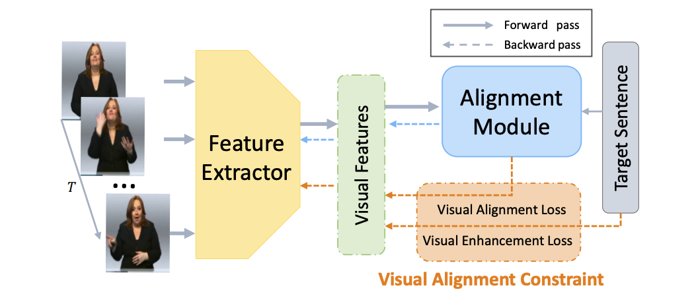

## Summary

With the aid of sign language, people with various forms of hearing impairment can interact with others in society. Most deaf individuals communicate with one another in sign language, which serves as both the primary bonding agent and a symbol of identification for community members.

Sign Language Translation consists of two parts, continuous sign language recognition and translation as shown in the figure. We convert a sign language video into continuous sign language vocabulary first and then translate these words into a normal sentence.



The goal of vision-based CSLR is to automatically identify signs from videos. We adopted a network architecture made up of a feature extractor and an alignment module. Each frame's visual information is abstracted by the feature extractor, and the alignment module looks for potential alignments between the visual features and the related labeling. By optimizing the probability of each possible alignment, a Connectionist Temporal Classification (CTC) is employed to align the prediction and labeling.

The main structure of the translation part is harnessed by transformer. For translation, we used a transformer in which the model contains a double layer encoder and decoder. This type of transformer can accomplish parallelization and it can achieve state-of-the-art results in the translation characteristic.

The table below shows the summary of the results:

|     **Methods**                                   |     **Model**                          |     **Metrics**     |     **Score**     |
|-----------------------------------------------|------------------------------------|-----------------|---------------|
|     Continuous Sign   Language Recognition    |     ResNet50                       |     WER         |     21.6%     |
|     Translation                               |     2-layer   Transformer          |     BLEU   4    |     22.59%    |
|     Transfer Learning                         |     Same as translation   model    |     BLEU 3      |     30.87%    |

## Project Organization
------------

    ├── LICENSE
    ├── README.md               <- The top-level README for developers using this project.
    ├── data
    │   └── SLR                 <- Sign Language Recognition Dataset
    │       ├── processed           <- Preprocessed data that is ready for modeling.
    │       └── raw                 <- The original, immutable data dump.
    │
    ├── docs                    <- Documentation.
    │
    ├── models                  <- Trained and serialized models, model predictions, or model summaries
    │
    ├── notebooks               <- Jupyter notebooks. Naming convention is a number (for ordering),
    │                              the creator's initials, and a short `-` delimited description, e.g.
    │                              `1.0-jqp-initial-data-exploration`.
    │
    ├── references              <- Data dictionaries, manuals, and all other explanatory materials.
    │
    ├── reports                 <- Generated analysis as HTML, PDF, LaTeX, etc.
    │   └── figures             <- Generated graphics and figures to be used in reporting
    │
    ├── requirements.txt        <- The requirements file for reproducing the analysis environment, e.g.
    │                              generated with `pip freeze > requirements.txt`
    │
    └── src                     <- Source code for use in this project.
        ├── __init__.py         <- Makes src a Python module
        │
        └── SLR                 <- Source code for Sign Language Recognition
            ├── data            <- Scripts to preprocess and load data
            ├── models          <- Model-related scripts, including model construction and training
            ├── visualization   <- Scripts to create exploratory and results-oriented visualizations
            └── run.py          <- Script to train and evaluate model

--------
## Sign Language Recognition

### Environment Setup

- Install `ctcdecode`

   > Note: install may not succeed under Windows.

   1. `git clone --recursive https://github.com/parlance/ctcdecode.git`
   2. `cd ctcdecode && pip install .`

- Install and initialize `wandb`
   1. `pip install wandb`
   2. `wandb init`

### Data Preprocessing

1. Download **Phoenix-2014T** dataset and extract it to `data/SLR/raw/`, rename the data folder as `Phoenix2014T`. The directory structure should be like:

```
└── Phoenix2014T
    ├── annotations
    ├── evaluation
    ├── features
    └── models
```

2. In the project root folder, run cmd `python src/SLR/prepare_data.py --config configs/SLR/phoenix2014T-res18.yaml`


<!-- ### Download Model Weights

Download pre-trained model weights, see [here](https://github.com/ycmin95/VAC_CSLR). Put the downloaded model weights under `models/SLR/` -->

### Training

In the project root folder, run cmd `python src/SLR/train.py --config configs/SLR/phoenix2014-res18.yaml`

### Evaluation

In the project root folder, run cmd `python src/SLR/eval.py --config configs/SLR/phoenix2014-res18.yaml --weights CHECKPOINT_FILE_PATH`

--------

<p><small>Project based on the <a target="_blank" href="https://drivendata.github.io/cookiecutter-data-science/">cookiecutter data science project template</a>. #cookiecutterdatascience</small></p>
